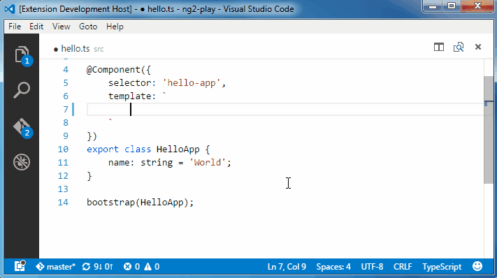

# Angular 2 TypeScript Emmet suport for VS Code

Have you ever missed vscode zen coding support for Angular 2 typescript. If is you answer yes than enjoy 
this extension to Visual studio code.

## Installation

1. Install Visual Studio Code 1.0.0 or higher
2. Launch Code
3. From the command palette `Ctrl`-`Shift`-`P` (Windows, Linux) or `Cmd`-`Shift`-`P` (OSX)
4. Select `Install Extension`
5. Choose the extension Angular 2 TypeScript Emmet
6. Reload Visual Studio Code

## Usage

Type abbrevation using [emmet](http://docs.emmet.io/abbreviations/) syntax, press `tab`, and the content will be replaced to HTML.

## Features

Replace abbreviation inside template property of Component decorator.