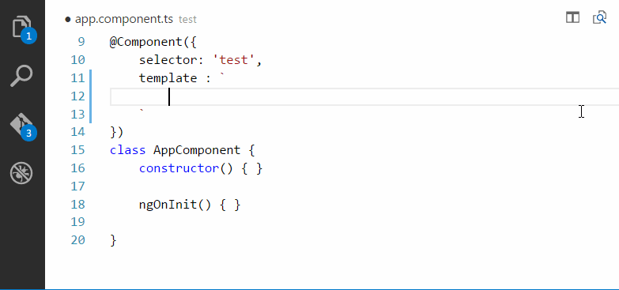

# Angular 2 TypeScript Emmet suport for VS Code

Have you ever missed zen coding support for Angular 2 typescript files inside vscode? If is your answer yes then following extension to Visual Studio Code solve you issue.

## Installation

1. Install Visual Studio Code 1.0.0 or higher
2. Launch Code
3. From the command palette `Ctrl`-`Shift`-`P` (Windows, Linux) or `Cmd`-`Shift`-`P` (OSX)
4. Select `Install Extension`
5. Choose the extension Angular 2 TypeScript Emmet
6. Reload Visual Studio Code

## Usage

Type abbreviation using [emmet](http://docs.emmet.io/abbreviations/) syntax, press `tab`, and the abbreviation will be replaced by HTML content.

## Features

Replace abbreviation inside template property of Component decorator.

## Known Issues

It will break any snippet's logic e.g. looping through points of interests for I'm not yet sure how to bubble up tab key event, vscode doesn't support the same native API which would be a really useful for such cases.  